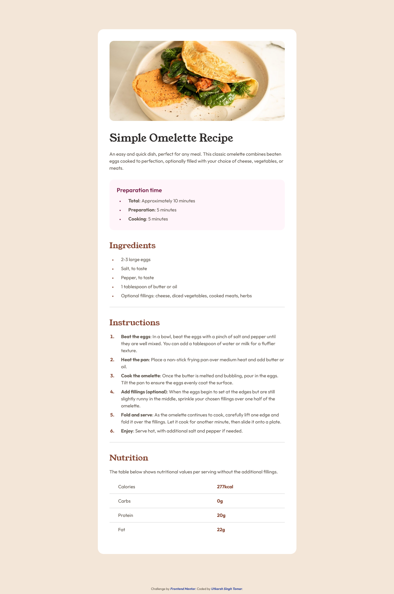
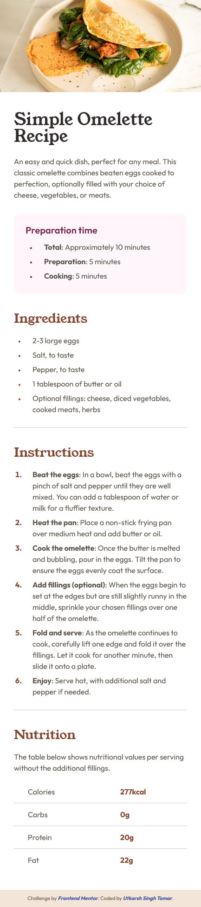

# Frontend Mentor - Recipe page solution

This is a solution to the [Recipe page challenge on Frontend Mentor](https://www.frontendmentor.io/challenges/recipe-page-KiTsR8QQKm). Frontend Mentor challenges help you improve your coding skills by building realistic projects.

## Table of contents

- [Overview](#overview)
  - [The challenge](#the-challenge)
  - [Screenshot](#screenshot)
  - [Links](#links)
- [My process](#my-process)
  - [Built with](#built-with)
  - [What I learned](#what-i-learned)

## Overview

### Screenshot

_Desktop Screenshot_

  
_Mobile Screenshot_

### Links

- Solution URL: [Frontend Mentor](https://www.frontendmentor.io/solutions/responsive-recipe-page-using-media-queries-DiAiR3bof9)
- Live Site URL: [Github](https://singh-ut.github.io/FEMC_Recipe-Page/)

## My process

### Built with

- Semantic HTML5 markup
- CSS custom properties
- CSS Grid
- Mobile-first workflow

### What I learned

- making responsive layout
- styling list
- using of css custom properties
- loading custom font files locally using font-face at-rule
